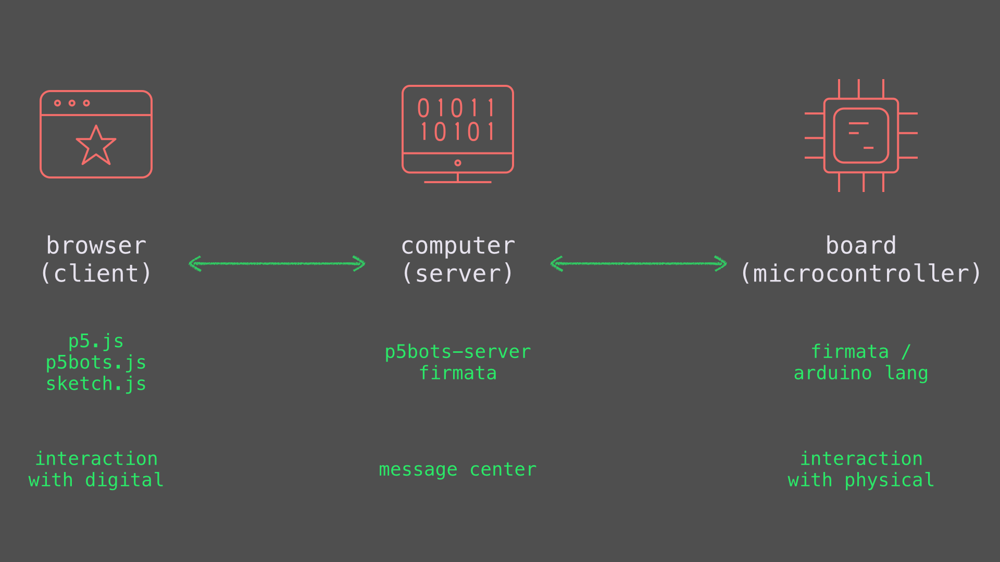

# Welcome to p5bots!

* [How Does This Work?](#how-does-this-work)
* [p5.Serial](#p5serial)
* [p5.Board](#p5board)
* [Getting Started](#getting-started)
* [Finding Informataion](#finding-information)  
* [Issues](#issues)
* [Contributing](#contributing)

## How Does This Work?

p5.bots is a library to facilitate communication between [p5.js](http://p5js.org/) running in your browser and a microcontroller* running [Firmata](https://github.com/firmata/arduino)**.

> \* The library has been tested on Arduino Unos, but should work on anything running Firmata.  
> \** The serial API does not depend on Firmata.

To do this, it uses the `socket.io` library and `node.js` to send messages between the two devices, in a language each device can understand.

This way, you can click on a sketch to light an LED or use temperature data to drive a sketch — or more.

p5bots comprises two sets of files: the client file, called `p5bots.js`, which is included in the `index.html` along with `p5.js` and your sketch; and the server files, called `p5bots-server`, which can be downloaded from [npm](https://www.npmjs.com/package/p5bots-server).

## p5.Serial
p5bots has a [`p5.serial` method](src/client/README.md#serial) that can be used in combination with an Arduino sketch listening for serial, much in the same way the Processing serial library can.

For more details on this module, see [serial in the API reference](src/client/README.md#serial).

If you use serial only, you do not need to install Firmata on your board.

## p5.Board
The majority of p5bots functionality lives within `p5.board`. Inspired by [Johnny-Five](http://johnny-five.io/), p5.board provides a number of hardware-specific methods in addition to plain digital, analog, and pwm read/write methods.

Details for these methods, plus examples can be found in the module pages. Example sketches and hardware diagrams are also available in [the examples directory](examples).

## Getting Started
Ready to go? Good entry points include:
* [the Hello, World tutorial](examples/HelloWorld.md)
* [checking out examples, say for RGB LEDs](https://github.com/sarahgp/p5bots/tree/master/examples#rgb-write)
* reading about [the client API](src/client/README.md), which lists the methods you can use in your p5 code and covers setting up in detail, and [p5bots-server](https://github.com/sarahgp/p5bots/tree/master/src/p5bots-server)
* or, [heading over to p5.js to learn more about the drawing library](http://p5js.org/)

## Finding Infomation
Detailed explanations of functionality have been broken up by subject:
  - Getting set up and using the library with p5.js: [p5.bots API](src/client/README.md)  
  - Setting up and testing the server files: [p5.bots server](src/p5bots-server/)
  - Examples showing p5.bots alongside p5 functions: [examples](examples)

## Issues
[Report issues in this repo.](https://github.com/sarahgp/p5bots/issues)

## Contributing
Want to fix an issue you've identified? Looking to create some functionality we have yet to add? Check out  [CONTRIBUTING.md](https://github.com/sarahgp/p5bots/blob/master/CONTRIBUTING.md).

## License
[LGPL](license.txt)
