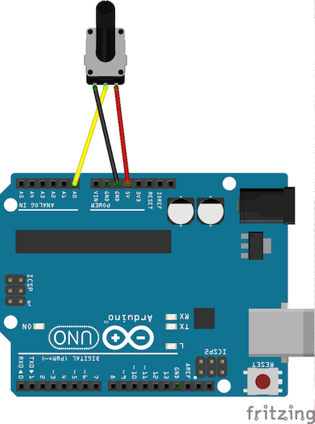
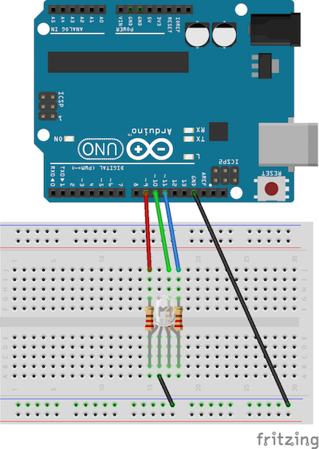
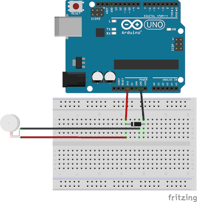
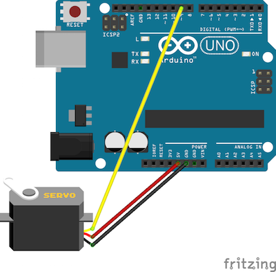

# Welcome to the Examples!

This section contains example implementations for each of the standard and special modes:

  -[Basics](#basics)  
  -[LEDs](#leds)  
  -[RGB LEDs](#rgb-leds)  
  -[Motor & Servo](#motor--servo)  
  -[Button](#button)  
  -[Variable Resistors](#variable-resistors)  
  -[Temperature](#temperature)  
  -[Piezo: Tone & Knock](#piezo-tone--knock)  
  -[Serial](#serial)  

Script files for each of these examples are available in (`example_scripts`)(example_scripts). You can determine which is run by editing [this line](https://github.com/sarahgp/p5bots/blob/master/examples/index.html#L13) to point to the script you want to run:

```html
   <!-- Swap out the script below with any of the others in example_scripts. -->
   <script src="/example_scripts/01_basics/03_ButtonDraw.js"></script>
```

Or peruse the examples below and morph them to make your own!

### Finding Your Port

The examples may fail if your port has a different name than the default port: `/dev/cu.usbmodem1421`, aka the left-side USB port on a MacBook Air.

Common ports include:

```js
/dev/cu.usbmodem1421 // MacBook Air, left side
/dev/cu.usbmodem1411 // MacBook Air, right side; MacBook, left side
/dev/cu.usbmodem1451 // MacBook, right side
```

If your computer is not on this list — or if these fail — you can find your port by opening the Arduino IDE and finding the port under `Tools > Port` or by running the following in your Terminal with the Arduino plugged in:

```bash
 ls /dev/tty.*
```

## Examples

### Basics

#### Digital Read
  
_diagram: simple_button_

```js
// Board setup — you may need to change the port
var b = p5.board('/dev/cu.usbmodem1421', 'arduino');

// Test digital read
var p = b.pin(9, 'DIGITAL', 'INPUT');
p.read(function(val){console.log(val);});

function setup() {

  var innerStr = '<p style="font-family:Arial;font-size:12px">'
  innerStr += 'Check out the console for readings</p>';

  createDiv(innerStr);
}
```


#### Analog Read
  
_diagram: potentiometer_

```js
// Board setup — you may need to change the port
var b = p5.board('/dev/cu.usbmodem1421', 'arduino');

// Test analog read
var p = b.pin(0, 'ANALOG', 'INPUT');
p.read(function(val){console.log(val);});

function setup() {
  createCanvas(300, 200);

  var innerStr = '<p style="font-family:Arial;font-size:12px">'
  innerStr += 'Check out the console for readings</p>';

  createDiv(innerStr);
}
```


#### Button Draw
  
_diagram: simple_button_

```js
// Board setup — you may need to change the port
var b = p5.board('/dev/cu.usbmodem1421', 'arduino');

// Draw ellipses with a button

var p;

function setup() {
  p = b.pin(9, 'DIGITAL', 'INPUT');
  p.read();

  createCanvas(1200, 300);
  noStroke();

  var innerStr = '<p style="font-family:Arial;font-size:12px">'
  innerStr += 'Press the button</p>';

  createDiv(innerStr);
}

function draw() {
  if (p.val) {
    fill(Math.random() * 255, Math.random() * 255, Math.random() * 255);
    ellipse(Math.random() * width, Math.random() * height, 60, 60);
  }
}
```


#### Light LED (Digital Write)
  
_diagram: led_

```js
// Board setup — you may need to change the port
var b = p5.board('/dev/cu.usbmodem1421', 'arduino');

// Click the circle to light the LED
 
var pin;

function setup() {
  createCanvas(400, 400);
  noStroke();
  fill(62, 0, 255);
  ellipse(width/2, height/2, 100, 100);
  pin = b.pin(9, 'DIGITAL', 'OUTPUT');
}

function mousePressed() {
  var d = dist(width/2, height/2, mouseX, mouseY);
  if (d < 100) {
    pin.write('HIGH');
  }
}

function mouseReleased() {
  pin.write('LOW');
}
```

Alternately, integrated with p5.DOM element.

```js
// Board setup — you may need to change the port
var b = p5.board('/dev/cu.usbmodem1421', 'arduino');

// Click a button to light the LED

function setup() {
  createCanvas(400, 400);
  var pin = b.pin(9, 'DIGITAL', 'OUTPUT');

  
  var button = createButton('LIGHT THE LED!!');
  button.position(width/2, height/2);
  button.mousePressed(function(){
    pin.write('HIGH');
  });

  button.mouseReleased(function(){
    pin.write('LOW');
  });
}
```


#### PWM Slider (PWM)
  
_diagram: led_

```js
// Board setup — you may need to change the port
var b = p5.board('/dev/cu.usbmodem1421', 'arduino');

// PWM Slider

var slider, pin;

function setup() {
  slider = createSlider(0, 255, 150);
  slider.position = (10, 10);
  pin = b.pin(9, 'PWM', 'OUTPUT');

}

function draw() {
  var val = slider.value();
  pin.write(val);
}
```

### LEDs
#### LED Blink
  
_diagram: led_

```js
// Board setup — you may need to change the port
var b = p5.board('/dev/cu.usbmodem1421', 'arduino');

// Blink LED 
var led;

function setup() {
  led = b.pin(9, 'LED');

  createCanvas(300, 200);

  var innerStr = '<p style="font-family:Arial;font-size:12px">'
  innerStr += '<b>&larr;</b> LED on &nbsp; | &nbsp;';
  innerStr += '<b>&rarr;</b> LED off &nbsp; | &nbsp;';
  innerStr += '<b>&uarr;</b> Blink LED &nbsp; | &nbsp;';
  innerStr += '<b>&darr;</b> Stop Blinking </p>';

  createDiv(innerStr);
}

function keyPressed() {
  if (keyCode === LEFT_ARROW){
    led.on();
  } else if (keyCode === RIGHT_ARROW) {
    led.off();
  } else if (keyCode === UP_ARROW){
    led.blink();
  } else if (keyCode === DOWN_ARROW) {
    led.noBlink();
  }
}
```

#### LED Fade 
  
_diagram: led_

```js
// Board setup — you may need to change the port
var b = p5.board('/dev/cu.usbmodem1421', 'arduino');

// Fade LED 

var led;

function setup() {
  led = b.pin(9, 'LED');

  createCanvas(300, 200);

  var innerStr = '<p style="font-family:Arial;font-size:12px">'
  innerStr += '<b>&darr;</b> Fade </p>';

  createDiv(innerStr);
}

function keyPressed(){
 if (keyCode === DOWN_ARROW) {
  led.write(200);
  led.fade(200, 0);
 } 
}
```


### RGB LEDs
#### RGB Write
  
_diagram: rgb_

```js
// Board setup — you may need to change the port
var b = p5.board('/dev/cu.usbmodem1421', 'arduino');

function setup() {
  var rgb = b.pin({r: 9, g: 10, b: 11}, 'RGBLED');
  var c = color(65);
  rgb.write(c);
  fill(c);
  noStroke();
  ellipse(80, 80, 40, 40);
}
```

#### RGB Read
  
_diagram: rgb_

```js
// Board setup — you may need to change the port
var b = p5.board('/dev/cu.usbmodem1421', 'arduino');

var rgb, c;

function setup() {

  createCanvas(300, 200);

  var innerStr = '<p style="font-family:Arial;font-size:12px">'
  innerStr += 'Press any key & check out the console for readings</p>';

  createDiv(innerStr);


  rgb = b.pin({r: 9, g: 10, b: 11}, 'RGBLED');
  c = color(Math.floor(Math.random() * 255), Math.floor(Math.random() * 255), Math.floor(Math.random() * 255));
  rgb.write(c);
  fill(c);
  noStroke();
  ellipse(80, 80, 40, 40);
}

// On any key press logs the color to the console
function keyPressed(){
  rgb.read(function(val){ console.log(val.toString()); });
}
```

#### Blink RGB
  
_diagram: rgb_

```js
// Board setup — you may need to change the port
var b = p5.board('/dev/cu.usbmodem1421', 'arduino');

// RGB LED On/Off/Blink
var rgb, c;

function setup() {

  createCanvas(300, 200);

  var innerStr = '<p style="font-family:Arial;font-size:12px">'
  innerStr += '<b>&larr;</b> LED on &nbsp; | &nbsp;';
  innerStr += '<b>&rarr;</b> LED off &nbsp; | &nbsp;';
  innerStr += '<b>&uarr;</b> Blink LED &nbsp; | &nbsp;';
  innerStr += '<b>&darr;</b> Stop Blinking </p>';

  createDiv(innerStr);

  rgb = b.pin({r: 9, g: 10, b: 11}, b.RGBLED);
  c = color(Math.floor(Math.random() * 255), Math.floor(Math.random() * 255), Math.floor(Math.random() * 255));
  rgb.write(c);
  fill(c);
  noStroke();
  ellipse(150, 100, 40, 40);
}

function keyPressed() {
  if (keyCode === LEFT_ARROW){
    rgb.on();
  } else if (keyCode === RIGHT_ARROW) {
    rgb.off();
  } else if (keyCode === UP_ARROW){
    rgb.blink();
  } else if (keyCode === DOWN_ARROW) {
    rgb.noBlink();
  }
}
```

#### Fade RGB
  
_diagram: rgb_

```js
// Board setup — you may need to change the port
var b = p5.board('/dev/cu.usbmodem1421', 'arduino');

// Fade RGB
var rgb;

function setup() {

  createCanvas(300, 200);

  var innerStr = '<p style="font-family:Arial;font-size:12px">'
  innerStr += '<b>&darr;</b> Fade </p>';

  createDiv(innerStr);

  rgb = b.pin({r: 9, g: 10, b: 11}, 'RGBLED');
  var c = color(Math.floor(Math.random() * 255), Math.floor(Math.random() * 255), Math.floor(Math.random() * 255));
  rgb.write(c);
  fill(c);
  noStroke();
  ellipse(80, 80, 40, 40);
}

function keyPressed(){
 if (keyCode === DOWN_ARROW) {
  rgb.write([200, 200, 200]);
  rgb.fade([200, 0, 3000], [200, 0, 5000, 50], [200, 0, 1000, 50]);
 } 
}
```

### Motor & Servo
#### 
  
_diagram: motor_

```js
// Board setup — you may need to change the port
var b = p5.board('/dev/cu.usbmodem1421', 'arduino');

// Test motor functionality
var motor;

function setup() {
  motor = b.pin(9, 'MOTOR');

  createCanvas(300, 200);

  var innerStr = '<p style="font-family:Arial;font-size:12px">'
  innerStr += '<b>&larr;</b> Motor on &nbsp; | &nbsp;';
  innerStr += '<b>&rarr;</b> Motor off &nbsp; | &nbsp;';
  innerStr += '<b>&uarr;</b> motor.write(100) </p>';

  createDiv(innerStr);
}

function keyPressed() {
  if (keyCode === LEFT_ARROW){
    motor.on();
  } else if (keyCode === RIGHT_ARROW) {
    motor.off();
  } else if (keyCode === UP_ARROW){
    motor.write(100);
  }
}
```

#### 
  
_diagram: servo_

```js
// Board setup — you may need to change the port
var b = p5.board('/dev/cu.usbmodem1421', 'arduino');

// Test servo functionality
var servo;

function setup() {
  createCanvas(300, 200);

  var innerStr = '<p style="font-family:Arial;font-size:12px">'
  innerStr += '<b>&larr;</b> To 15 &nbsp; | &nbsp;';
  innerStr += '<b>&rarr;</b> To 45 &nbsp; | &nbsp;';
  innerStr += '<b>&uarr;</b> Sweep &nbsp; | &nbsp;';
  innerStr += '<b>&darr;</b> Stop Sweeping </p>';

  createDiv(innerStr);

  servo = b.pin(9, 'SERVO');
  servo.range([0, 60]);
}

function keyPressed() {
   if (keyCode === LEFT_ARROW) {
     console.log('l')
     servo.write(15);
   } else if (keyCode === RIGHT_ARROW) {
     console.log('r')
     servo.write(45);
   } else if (keyCode === UP_ARROW) {
     console.log('u')
     servo.sweep();
   } else if (keyCode === DOWN_ARROW) {
     console.log('d')
     servo.noSweep();
   } 
}
```

### Button
#### 
  
_diagram: led_
```js
```

### Variable Resistors
#### 
  
_diagram: led_
```js
```

### Temperature
#### 
  
_diagram: led_
```js
```

### Piezo: Tone & Knock
#### 
  
_diagram: led_
```js
```

#### 
  
_diagram: led_
```js
```

### Serial
#### 
  
_diagram: led_
```js
```