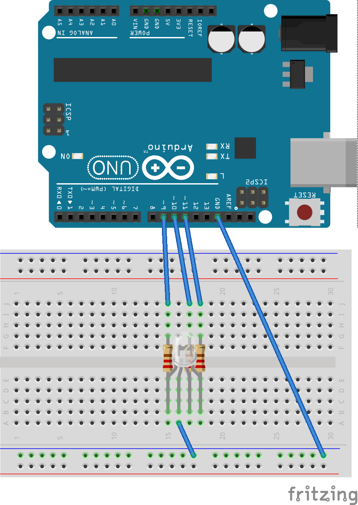

# p5bots-server

These are the files necessary for the server end of the p5bots setup. 

_Note: This is still version 0.0.x, so there are a lot of todos left. Anything can happen._

## Setup

### Arduino
1. Download Arduino IDE
2. Upload Examples > Firmata > StandardFirmata to your board
3. Write down the port your board is using; you may need it later.

### Javascript
1. Install node & npm if you haven't already; be sure you have node 0.12.x+ and npm 2.0.x+
2. Install firmata on your computer: `npm install -g firmata`
3. `npm install` in the `p5bots-server` directory

## Run Examples

To test your setup, you can run any of the examples in `examples/quicktest.js`. (It's inside the `node_modules/p5bots-server` folder.)

Currently, the RGB LED test is uncommented. To run this, set up the breadboard like this:



then run:

```js
bots-go -d 'node_modules/p5bots-server/example'
```

Open your browser to `localhost:8000` and you should see a circle whose color is also displayed on your RGB Led.

For other examples, checkout `node_modules/p5bots-server/example/quicktest.js` and try other layouts. From the `/p5bots-server` folder, you can run `npm run examples-go` to get the server up.

:rotating_light::rotating_light::rotating_light:

If you get an error telling you the board cannot be found, or something like:

```js
Error: Error: Cannot open /dev/cu.usbmodem1421
```

you may have to adjust [the board declaration in `quicktest.js`](https://github.com/sarahgp/p5bots/blob/master/src/p5bots-server/example/quicktest.js#L53).

Either use the port you noted down in setup, assuming you haven't moved the board, or check out the console, where we are listing the ports via the serial command. The one that looks like `/dev/cu.*` is likely the one you need.

## Command Line Options

`bots-go` can be run with the following options:

```
-d, --dir <d>        Set base directory for server
-f, --file <f>       Set file to use for the index page
-p, --ufilepath <p>  Path to file containing user-defined server-side listeners.
-n, --ufilename <n>  Path, inluding file name, to user-defined server-side listeners.
```

You can also find these by running

```js
node ./app.js -h
```